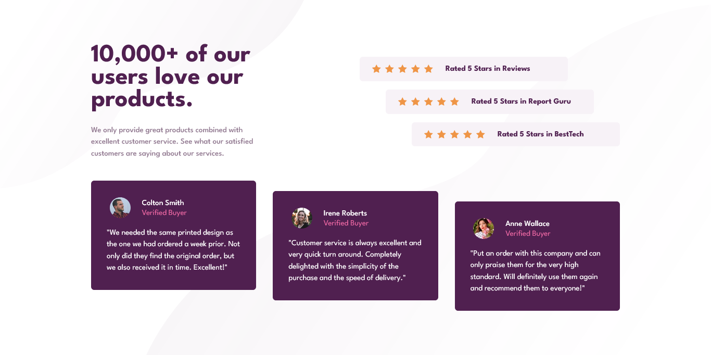

# Frontend Mentor - Social proof section solution

This is a solution to the [Social proof section challenge on Frontend Mentor](https://www.frontendmentor.io/challenges/social-proof-section-6e0qTv_bA). Frontend Mentor challenges help you improve your coding skills by building realistic projects. 

## Table of contents

- [Overview](#overview)
  - [The challenge](#the-challenge)
  - [Screenshot](#screenshot)
  - [Links](#links)
- [My process](#my-process)
  - [Built with](#built-with)
  - [What I learned](#what-i-learned)
  - [Continued development](#continued-development)
  - [Useful resources](#useful-resources)
- [Author](#author)

**Note: Delete this note and update the table of contents based on what sections you keep.**

## Overview

### The challenge

Users should be able to:

- View the optimal layout for the section depending on their device's screen size

### Screenshot

### Links

- Live Site URL: [Social Proof Section](https://arey-dev.github.io/social-proof-section-page/)

## My process

### Built with

- Semantic HTML5 markup
- CSS custom properties
- Flexbox
- CSS Grid

### What I learned

In this project, I learned how complicated responsiveness can be. I had troubles with my layout, especially when setting heights. I wasn't not sure at all if it's okay to set heights in the first place.

I understand when and when not to use CSS Grid much better now.

### Continued development

I want to practice CSS Grid model more and get used to it. I also want to deepen my understanding of accesibility, I think it will be a great practice to consider screen reader features. 

### Useful resources

- [MDN Web Docs](https://developer.mozilla.org/en-US/) - For references.
## Author

- Frontend Mentor - [@arey-dev](https://www.frontendmentor.io/profile/arey-dev)
